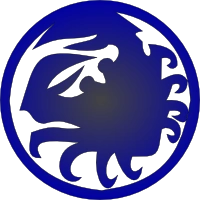

## About the Crab Clan

The Crab Clan serve as the Defenders of the Empire. They spend their lives upon the Carpenter Wall, standing vigilant along the southwestern border of Rokugan to defend against the next attack from the Shadowlands. The Crab Clan was founded by the Kami Hida. Every day, the Crab warriors give their lives defending the Wall so that the people of the other clans might live in peace and security. The Crab value this duty above everything, even honor. They might be gruff, unkempt and downright rude at times, but no one questions their strength or courage. [1]

[l5rwiki link](https://l5r.fandom.com/wiki/Crab_Clan)

### Characters

Name:	[Hida Kisada](/characters/crab/hidakisada/)
Position:	[Clan Champion](/termsandphrases/#clanchampion)
	[Daimyo](/termsandphrases/#daimyo)
Related:	[Hida Yakamo](/characters/crab/hidayakamo/)
	[Hida O-Ushi](/characters/crab/hidaoushi/)
	[Hida Sukune](/characters/crab/hidasukune/)

Name:	[Hida Yakamo](/characters/crab/hidayakamo/)
Position:	Hida heir apparent
Related:	[Hida Kisada](/characters/crab/hidakisada/)
	[Hida O-Ushi](/characters/crab/hidaoushi/)
	[Hida Sukune](/characters/crab/hidasukune/)

Name:	[Hida O-Ushi](/characters/crab/hidaoushi/)
Position:	Hida heir apparent
Related:	[Hida Kisada](/characters/crab/hidakisada/)
	[Hida Yakamo](/characters/crab/hidayakamo/)
	[Hida Sukune](/characters/crab/hidasukune/)

Name:	[Hida Sukune](/characters/crab/hidasukune/)
Position:	Hida heir apparent
Related:	[Hida Kisada](/characters/crab/hidakisada/)
	[Hida Yakamo](/characters/crab/hidayakamo/)
	[Hida O-Ushi](/characters/crab/hidaoushi/)

Name:	[Hiruma Yoshino](/characters/crab/hirumayoshino/)
Position:	Hiruma Daimyo
Related:	[Hiruma Kage](/characters/crab/hirumakage/)

Name:	[Hiruma Kage](/characters/crab/hirumakage/)
Position:	Hiruma heir
Related:	[Hiruma Yoshino](/characters/crab/hirumayoshino/)

Name:	[Kaiu Shihobu](/characters/crab/kaiushihobu/)
Position:	Kaiu Daimyo
Related:	

Name:	[Yasuki Taka](/characters/crab/yasukitaka/)	
Position:	Yasuki Daimyo
Related:	[Yasuki Oguri](/characters/crab/yasukioguri/)

Name:	[Yasuki Oguri](/characters/crab/yasukioguri/)
Position:	Yasuki heir
Related:	[Yasuki Taka](/characters/crab/yasukitaka/)

Name:	[Yasuki Oguri](/characters/crab/yasukioguri/)
Position:	Yasuki heir
Related:	[Yasuki Taka](/characters/crab/yasukitaka/)

Name: [Kuni Yori](/characters/crab/kuniyori/)
Position: Kuni Daimyo
Related:

### Locations

### Families/Family Dynamics

#### Hida Family

#### Hiruma Family

#### Kaiu Family

#### Yasuki Family

#### Kuni Family

### Terms and Phrases Specific to the Crab Clan